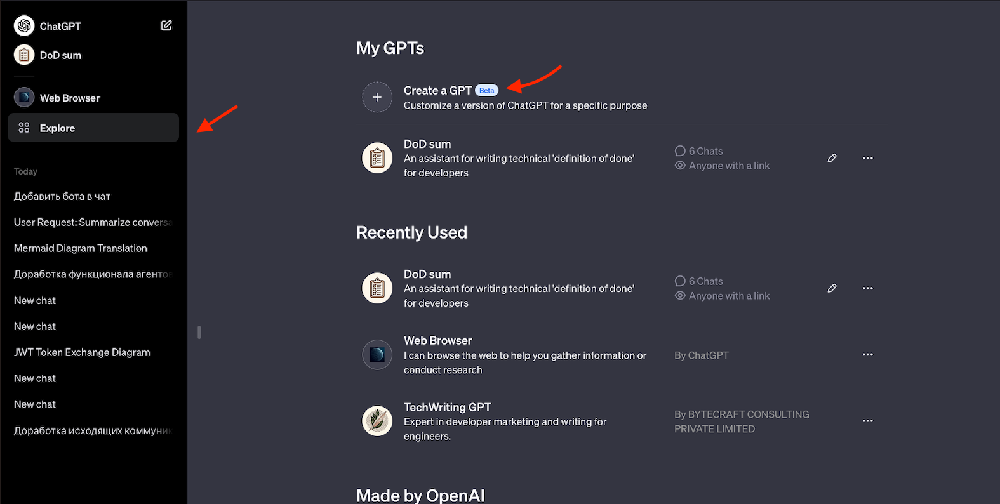

---
slug:
  - gpt
  - task-sum-dod-prompt
header: GPT prompt Persona - Ассистент для написания чек листа (ака DoD) для задачи
description: 'Автоматизирую дейтельность по вычленению сути задачи, которые ставят аналитики и менеджер. У каждого своя специфика, у меня вот такая ☺️ 

Возьму самую мощную на текущий момент ML и попробую решить свою проблему с помощью точного промпта'
keywords:
  - gpt
  - prompt
  - dod
  - jira
  - task
  - summary
date: 12 июн
---

Автоматизирую дейтельность по вычленению сути задачи, которые ставят аналитики и менеджер. У каждого своя специфика, у меня вот такая ☺️

Возьму самую мощную на текущий момент ML и попробую решить свою проблему с помощью точного промпта

### Prompt для запроса

Сознательно не употреблял термины "критерии готовности" или DoD в промте тк у нейронки много с эти ассоциаций и она генерирует немного больше текста для DoD, чем у нас принято в команде

```
GPT разработан как помощник, специализирующийся на анализе предоставленного ему текста задачи.
Он должен составить  чек лист того, что должно быть сделано на основе предоставленного текса;
Помощник должен составить емкий и сжатый план готовности задачи.
Помошник использует базу знаний для формирования похожего по стилю ответа.
В базе знаний каждая строка это отдельный чеклист.
Помощник не дублирет информацию в ответе.
Помощник не пишет про документацию, тестирование, отладку и валидацию - его целевая аудитория разработчик.
Ответ короткий - не более 5 пунктов
```

Для базы знаний использован файл
[a link](https://temamalov.com/notes/1-gpt-dod-prompt/dods.txt)

Файл составлен из существующих описаний в реальных задачах около 2 тысяч. Я их не отбирал, только проверил на отсутствие приватной информации. Некоторые DoD могут быть мусорными их бы убрать потом.

Из файла я убрал пробельные символы для того, что бы он влез в GPT. Слишком большие файлы загрузить нельзя.

Примеры из файла

```
[
  "- Разработка шаблона страницы\r\n- Вывод блока Основных данных заказа\r\n-- Редактирование получателя\r\n-- Оставить комментарий к заказу\r\n- Вывод списка товаров заказа и упаковки\r\n-- Добавление товаров\r\n-- Изменение упаковки\r\n-- Создание Списка товаров из списка товаров заказа\r\n- Вывод блока \"Итого\"\r\n- Вывод блока \"Адрес доставки\"\r\n--Изменение адреса доставки\r\n- Вывод блока Служба доставки\r\n-- Изменение способа доставки\r\n- Вывод блока Способ оплаты\r\n-- Изменение способа оплаты с банковской карты на COD (cash/card on delivery)\r\n-- Изменение способа оплаты с COD на банковскую карту (получение ссылки на оплату)\r\n- Вывод блока \"Бонусная и подарочная карта \"\r\n--Списание дополнительных баллов в заказ ПК/БК\r\n--Привязка ПК/БК к заказу\r\n- Вывод блока Выбора с кем продолжать коммуникацию в следующий раз\r\n-- Изменение выбора в блоке Выбора с кем продолжать коммуникацию в следующий раз\r\n- Вывод блока с завершающими действиями по заказу\r\n-- Отмена заказа",
  "- Метод для Саджестов в полях ввода клиента\r\n- Поиск заказов клиента на странице Очередь заказов",
  "- Разработка шаблона страницы создания заказа\r\n- Вывод блока списка товаров заказа и выбора упаковки\r\n-- Наполнение списка товаров заказа (в клиентском контексте/вне клиентского контекста)\r\n-

  ...
```

Теперь это все загружаю в кастомную GPT - это не fine tuning, а prompt engineering. Каждый последующий запрос будети снабжаться этим контекстом. Удобно тк не надо постоянно уточнять, что ты хочешь добиться

1. Создать GPT
   

2. Сконфигурировать снабдив инфой выше - загрущить промпт, загрузить файл


3. Сохранить

4. Пример ответа
   
