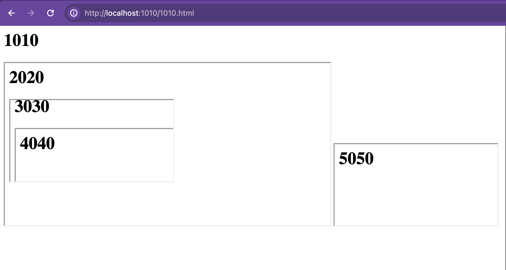

---
slug:
  - js
  - post-message
header: Iframe postMessage матрешка
description: Кто и кому может отправлять сообщение через границы iframe
keywords:
  - html
  - js
  - browser api
  - postMessage
  - boundaries
date: 12 июн
---

### Если на странице несколько фреймов, кто и кому может отправить сообщение?

[Link text Here](../1-gpt-dod-prompt/note.md)

Пример организации фреймов. Интересно, когда их действительно много. А еще они вкладываются друг в друга 🙃

Псевдокод такой

```html
<html>
  <body>
    <iframe src="http://localhost:2020">
      <iframe src="http://localhost:3030">
        <iframe src="http://localhost:4040"></iframe>
      </iframe>
    </iframe>
    <iframe src="http://localhost:5050"></iframe>
  </body>
</html>
```

Теперь, актуальный код каждой странички

### 1010.html

```html
<html>
  <head>
    <title>1010</title>
  </head>
  <body>
    <h1>1010</h1>
    <button id="hello">hello</button>
    <iframe src="http://localhost:2020/2020.html"></iframe>
    <iframe src="http://localhost:5050/5050.html"></iframe>
  </body>
</html>
```

Запуск

> http-server --port=1010

### 2020.html

```html
<html>
  <head>
    <title>2020</title>
  </head>
  <body>
    <h1>2020</h1>
    <button id="hello">hello</button>
    <iframe src="http://localhost:3030/3030.html">
  </body>
</html>
```

Запуск

> http-server --port=2020

### 5050.html

```html
<html>
  <head>
    <title>5050</title>
  </head>
  <body>
    <h1>5050</h1>
    <button id="hello">hello</button>
  </body>
</html>
```

Запуск

> http-server --port=5050

### 3030.html

```html
<html>
  <head>
    <title>3030</title>
  </head>
  <body>
    <h1>3030</h1>
    <button id="hello">hello</button>
    <iframe src="http://localhost:4040/4040.html"></iframe>
  </body>
</html>
```

Запуск

> http-server --port=3030

### 4040.html

```html
<html>
  <head>
    <title>4040</title>
  </head>
  <body>
    <h1>4040</h1>
    <button id="hello">hello</button>
  </body>
</html>
```

Запуск

> http-server --port=4040

Все запущено

