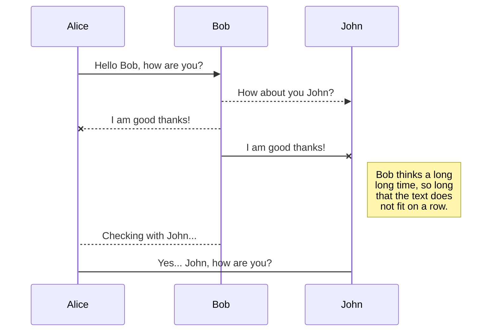
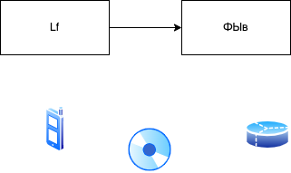

---
slug:
  - second-note
header: Architecture
description: 'Purumpumpum all have built-in yu, but these often differ from one language to another. This article attempts to list the built-in data structures available in JavaScript and no yes they have. These can be used to build other data structures. Wherever possible, comparisons with other languages are drawn.'
keywords:
  - programming
  - javascript
  - other
date: 12 июн
---

### Second

Simple text

- list
- list2

---

### Drawio demo

simple test img

# GFM

## Autolink literals

www.example.com, https://example.com, and contact@example.com.

# Image

## Footnote

A note[^1]

[^1]: Big note.

## Strikethrough

~one~ or ~~two~~ tildes.

## Table

| Tables |  Are   | Cool  | Not |
| :----: | :----: | :---: | :-: |
| 123123 | 212131 | 23123 | 123 |

## Tasklist

- [ ] to do
- [x] done
